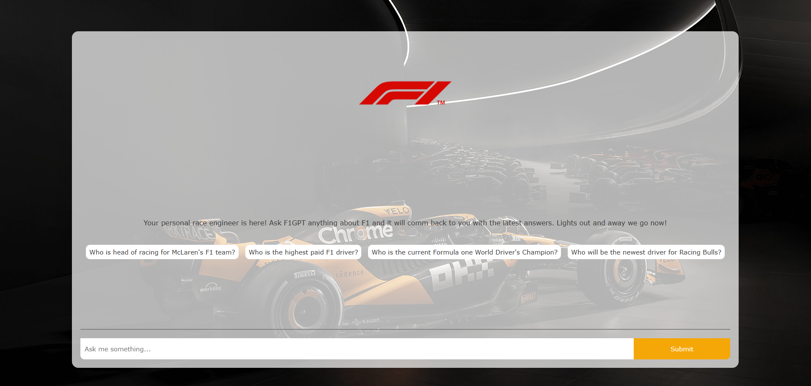

# 🏎️ F1GPT - Formula One RAG Chatbot

Your personal race engineer—powered by Retrieval-Augmented Generation (RAG), OpenAI, and Datastax Astra DB.  
Ask anything about Formula One and get intelligent, up-to-date responses.



---

##  What is This?

This project is a **Retrieval-Augmented Generation chatbot** for Formula One.  
It combines:

- **Vector Embeddings**: Transform user queries into dense vectors.
- **Astra DB (Datastax)**: Store and retrieve relevant documents with vector similarity search.
- **OpenAI GPT-4**: Generate high-quality answers using retrieved context.
- **Next.js + `ai/react`**: Real-time streaming frontend chat.

---

##  How It Works

1. **User asks a question.**
2. The question is embedded via the OpenAI Embeddings API.
3. The embedding queries Astra DB to find the most relevant documents.
4. The documents are injected into the system prompt.
5. GPT-4 streams a response chunk by chunk.
6. The frontend displays the answer live as it arrives.

---

## 🛠️ Prerequisites

Before running this project, you’ll need:

- **Node.js ≥ v18**
- An **OpenAI API key**
- A **Datastax Astra DB instance and application token**

---

##  Installation & Setup

Follow these steps:

1. **Clone the repository**
   ```bash
   git clone https://github.com/your-username/f1gpt.git
   cd f1gpt
2. **Install dependencies**
   npm install

## Project Structure
/app
  /api/chat/route.ts            // RAG API route
  /components                   // UI components (Bubble, PromptSuggestionsRow, etc.)
  /page.tsx                     // Chat interface
/global.css                     // Styling
/scripts/loadDb.ts              // DB seeding script

## Technologies Used

1.Next.js 14 App Router
2.React 18
3.OpenAI GPT-4 + Embeddings
4.Datastax Astra DB Vector Store
5.Vercel AI SDK (ai/react)

## Acknowledgments

Special thanks to:
OpenAI for GPT-4 and Embeddings
Datastax Astra DB for vector storage
Formula One data sources
Community tutorials and learning resources on RAG
